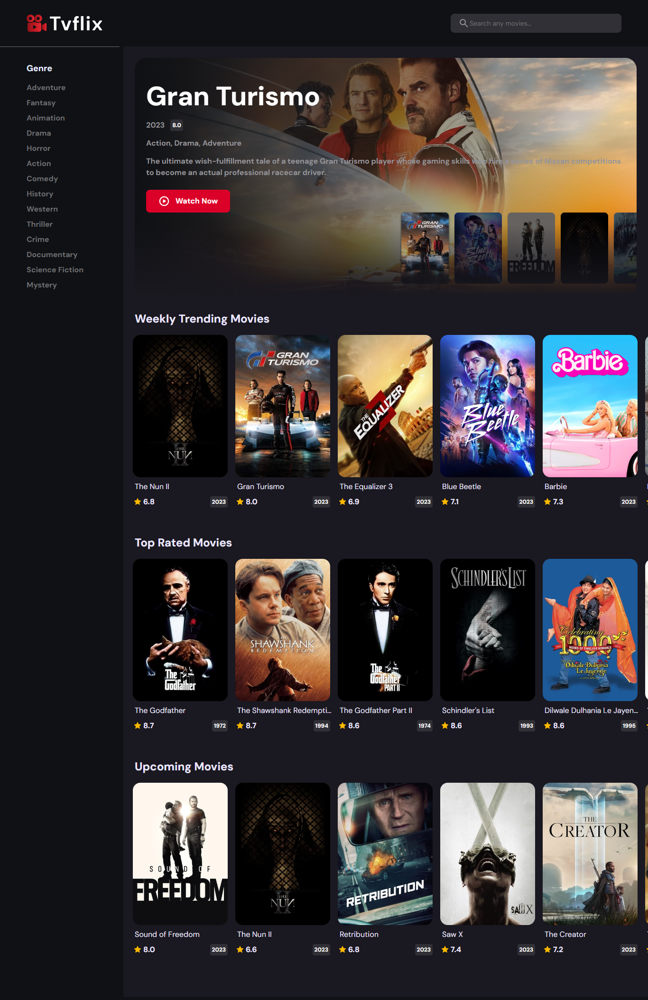

# TVFlix - Movie App

TVFlix Demo Screeshots.



TVFlix is a simple movie app that allows you to browse and search for movies and TV shows. It uses the data from The Movie Database (TMDb) API to provide information about movies, TV series, and more.

## Features

- Search for movies and TV shows.
- View movie details including cast, ratings, and synopsis.
- Browse popular, top-rated, and upcoming movies.
- Explore trending TV shows.
- Responsive design for mobile and desktop.

## Technologies Used

- HTML
- CSS
- JavaScript
- [The Movie Database (TMDb) API](https://www.themoviedb.org/documentation/api)

## Getting Started

To run TVFlix locally on your machine, follow these steps:

1. Clone the repository:

   ```bash
   git clone https://github.com/MAbdallaDev/tvflix-movie-app.git

2. Open the index.html file in VS Code.

3. Right-click within the index.html file and select "Open with Live Server." This will start a local server and open the app in your default web browser.

4. You can now use TVFlix to browse and search for movies and TV shows.
